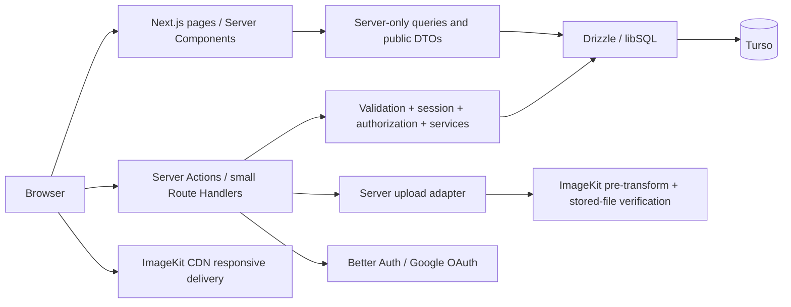

# Practical travel intelligence — implementation contract

Status: ready for implementation planning; no application has been built by this document.
Prepared: 6 September 2026.
Source: [product brief](../crowdsourced-practical-travel-intelligence.md).

## 1. Read this first

Build a small, polished, mobile-first knowledge base for independent travelers in India. A visitor searches a destination, reads what travelers actually paid or learned, and contributes one useful discovery. The product must remain useful without signing in.

This specification makes product and engineering decisions so an implementing model does not have to invent them. `MUST` denotes a release requirement. Examples are synthetic development fixtures, not verified travel recommendations.

Read these companion files in order:

1. This file: scope, behavior, storage, services, security, release gates.
2. [UI specification](ui-spec.md): exact tokens, layouts, component states, copy, responsive rules.
3. [Visual reference](design-reference.html): open in a browser; use its four screen views as the composition reference.
4. [Implementation work orders](implementation-work-orders.md): execute one work order at a time; report evidence before marking it complete.

Precedence: explicit user instructions → product behavior in this plan → UI specification for dimensions/states → visual reference for composition → original brief for rationale. The reference is a design artifact, not production code. Its sample controls do not define backend behavior. If two explicit requirements conflict, record the conflict rather than silently dropping one.

### Fixed decisions and declared assumptions

| Area | Decision |
|---|---|
| Database / ORM | Turso Cloud, libSQL connection, Drizzle ORM and committed SQL migrations |
| Application | Next.js App Router + strict TypeScript; one repository; Node.js runtime |
| Images | ImageKit; upload pre-transformation; verify persisted bytes before attachment |
| Authentication | Better Auth + Drizzle adapter; Google OAuth only |
| Styling | Tailwind CSS, CSS design tokens, selected shadcn/ui primitives, Lucide icons |
| Forms | React Hook Form + Zod; identical domain validation on the server |
| Geography / currency | India; INR only; store money in integer paise |
| Locale | English UI, Indian number formatting; calendar month semantics in Asia/Kolkata |
| Brand | Product name: `TrailNote`; motto: `Tell the next traveller what you wish someone had told you.` |
| Hosting | Plan assumes Vercel Node functions; separate preview and production resources |
| Theme | One carefully specified light theme for MVP |
| Upload size interpretation | Aim for 200–400 KB per stored photo; enforce at most 400,000 bytes. Already clear images below 200,000 bytes are accepted, never padded/upscaled merely to increase bytes |
| Contribution size | One practical tip, 10–1,000 trimmed Unicode characters, up to 3 optional photos |
| Visual fidelity | Match the supplied reference at fixed viewports; responsive/accessibility rules take priority at enlarged text sizes |

The 200 KB floor is interpreted as a quality target, not a minimum upload requirement. If a literal minimum is later required, resolve that explicitly before changing the image policy.

### Scope boundaries

MVP includes destination search, five categories, quick contribution, category-specific optional data, visited month, photos, contribution detail, Google sign-in, still-accurate confirmations, linked changed-information reports, helpful, reporting, own contribution edit/delete, and a small protected moderation queue. An authenticated account page is only a way to manage one's contributions and sign out.

Do not add bookmarks, itinerary planning, AI, messaging, followers, star ratings, global social feeds, booking, payments, recommendations, maps SDKs, badges, price comparison charts, reputation scores, dark mode, or multi-currency conversion. Public business/place entities and computed price ranges are deferred: loosely matching two names does not establish that their prices describe the same room, meal, season, or fare unit.

## 2. Success criteria and journeys

### Journey A — discover without an account

1. Load `/`: headline and destination search are immediately visible.
2. Type `bad`; suggestions appear after 250 ms, including Badami with state.
3. Select Badami → `/destinations/badami`.
4. First viewport shows destination, category filters, freshness explanation, and the first actual tip.
5. Read the fare, visit month, confirmation status and useful text on a card. Open detail only for more context, photos, updates or contact.

Target: get to a useful tip within 3 deliberate interactions, with no sign-in overlay or onboarding. Empty destinations are honestly empty.

### Journey B — share in approximately 15–30 seconds

1. Tap `Add a tip` on a destination.
2. Land on `/destinations/badami/add`; default is `Quick tip`, internally category `general`.
3. Write practical text. The destination is inherited; `Visited: This month` is visible and editable.
4. Tap `Share tip`. Signed-in users publish immediately after validation. Guests see a single Google sign-in panel while their text and metadata are retained.
5. After OAuth, restore the draft and focus `Share tip`; never silently publish after a redirect.
6. Show a success panel: `Tip added. Thanks for helping the next traveler.` with `View tip`, `Add another`, and category shortcuts. Retain destination and explicitly chosen visit month for the next contribution.

Only destination, category and useful text are mandatory. Visit month defaults visibly but can be `Not sure`; price, name, location, room type, contact and photo remain optional. Do not require a photo or a profile setup step. The time target excludes Google consent/network time and optional photos; measure a text-only repeat contribution with actual people.

### Journey C — maintain accuracy

* `Still accurate`: signed-in non-author records that the current version remains accurate. First action assumes this month and immediately offers `Undo` and `Change month`. Unknown visit date cannot confirm freshness.
* `Changed`: open the same composer in update mode, linked to the current tip/revision, with a required change explanation and optional revised fields. The button reads `Share update`.
* `Helpful`: a lightweight personal toggle; it does not affect freshness.
* `Report`: reason selector plus optional context, with confirmation. Reporting does not itself verify or correct information.

Guests are prompted for Google only when invoking a write. Returning from sign-in restores the intended screen and highlights the relevant action; it never automatically casts a confirmation, helpful vote, or report.

## 3. Routes and navigation contract

| Route | Access | Purpose and indexing |
|---|---|---|
| `/` | Public | Search-first home; indexable |
| `/search?q=...` | Public | Search submission fallback/results; noindex |
| `/destinations/[slug]` | Public | Destination reports; indexable canonical without filters |
| `/destinations/[slug]?category=transport&sort=recent&cursor=...` | Public | Shareable filtered/paginated state; canonical to destination |
| `/destinations/[slug]/add` | Public compose, protected write | Quick/category tip; noindex |
| `/tips/[id]` | Public if published | Detail, photos, revision-aware confirmations and updates; indexable |
| `/tips/[id]/edit` | Author | Reuses composer, optimistic concurrency; noindex |
| `/tips/[id]/update` | Public compose, protected write | Changed-information contribution; noindex |
| `/sign-in?returnTo=...` | Public | Google-only route and OAuth error recovery; noindex |
| `/me` | Authenticated | Own contributions, account name, sign out; noindex |
| `/moderation` | Moderator | Report queue with open/resolved tabs; noindex |
| `/privacy`, `/terms`, `/community-guidelines` | Public | Concise, accurate launch policies; indexable |
| `/contact-removal` | Public | Service-contact removal request form; noindex |

Invalid slugs/IDs render the designed 404. Hidden and deleted tips are absent from public queries and return 404; authors can see a status notice via `/me`. Invalid query enum values fall back to defaults. Malformed cursors are a recoverable 400 or a `Start again` result state, never a 500.

Category URL values: `all`, `stay`, `food`, `transport`, `explore`, `general`; omit `all` in canonical URLs. Visible labels: `All`, `Stay`, `Food`, `Transport`, `Explore`, `Tips`. Composer uses `Quick tip` for `general`. Sort values: `recent` (default), `newest`. Recent means latest first-hand observation, not latest edit or helpful count.

## 4. Domain rules — implement these before screens

### Contributions and optional structured data

Common: destination, category, body, visited month or null; optional price, location text, maps URL, contact, photos. See [form matrix](ui-spec.md#7-composer) for field order and labels.

* Category-specific fields are explicitly typed nullable columns, not an unvalidated miscellaneous JSON bag.
* When price is present, its unit is required and given a visible category default; general tips require explicit unit selection. `0` is a valid known price, null is unknown. Display `Free` for zero entry fees; use `₹0` for other zero prices. Never display null as `Free` or `₹0`.
* Allowed units: `room_night`, `bed_night`, `person_night`, `meal`, `item`, `person_trip`, `vehicle_trip`, `entry_person`, `other`. `other` needs a unit label up to 40 characters.
* Stay: optional `placeName`, `roomType` (`private`, `dorm`, `shared`, `other`), `bookingMethod` (`direct_call`, `walk_in`, `online`, `other`). Price default `room_night`; changing to dorm suggests `bed_night` visibly.
* Food: optional `placeName`, `dish`; price default `meal`.
* Transport: optional `fromName`, `toName`, `transportMode` (`bus`, `train`, `shared_jeep`, `auto`, `taxi`, `ferry`, `rental`, `other`), `durationMinutes`; price default `person_trip`. Never silently turn a vehicle fare into a per-person fare.
* Explore: optional `placeName`, `walkMinutes`; price default `entry_person`.
* General: useful text plus optional common metadata; no required title.
* Generated display title: place name; or `From → To` when both are available; otherwise `{Category label} tip in {Destination}`. Do not invent a venue or use an AI title.
* Text is plain text with preserved newlines. No HTML, Markdown renderer or clickable arbitrary links embedded in body for MVP.
* Location uses human text and optional allowlisted HTTPS maps link. Never request device geolocation automatically. Coordinates are not required and no maps API is necessary.

Validation constants: place/from/to/dish max 120 characters each; location max 200; tip 10–1,000; report/update-context max 1,000; duration/walk integer 1–2,880 minutes; money string up to 2 decimals, parse exactly into integer paise, range 0–100,000,000 paise. Reject negatives, exponent notation, NaN and overflow. Empty optional values become null. Accept Unicode names and multilingual contribution text despite the English interface. Count text limits consistently as Unicode code points after trimming, rather than mixing JavaScript UTF-16 length with a different UI counter.

### Visit date and freshness

Store a visit month as `YYYY-MM`, validated as a real month from `2000-01` through the current India calendar month. Never convert month precision into a falsely precise day in the UI. `Not sure` stores null, shown as `Visit month not provided`.

For a current revision:

```
eligible confirmation = current revision + visible active user + not author
                       + confirmed month >= contribution visited month if known
lastConfirmedMonth = max(eligible confirmation.month), or null
effectiveMonth = max(non-null contribution.visitedMonth, lastConfirmedMonth)
ageMonths = currentYear * 12 + currentMonth - effectiveYear * 12 - effectiveMonthNumber
```

Freshness label policy (a product heuristic, not a guarantee): age 0–3 → `Recent visit` or `Recently confirmed`; age 4–6 → `A few months old`; age >=7 → `May have changed`; no effective month → `Visit month unknown`. Observation months stay visible on detail at their recorded precision. An unresolved published update takes badge priority as `Change reported`, regardless of recency; still show actual observation months below it.

`Last confirmed` refers only to another traveler; the author cannot self-confirm. Helpful votes, reports, photo uploads and `updatedAt` MUST NOT advance freshness. On first confirmation store month=this month, then show `Confirmed for September 2026 · Change month · Undo`. A later-month re-confirmation updates the same user's current-revision row, not the unique-traveler count. Tapping an already confirmed state opens its edit/undo popover rather than silently undoing it.

Allow confirmation-month correction to a valid previous month, constrained by known original visited month. Rate limiting does not invalidate an already recorded confirmation. Last-confirmed timestamp uses observation month, not the timestamp of a late submission.

### Changed information, revisions, and conflicts

* Changed creates a separate contribution with its own author, visited month, price/fields and `parentContributionId` + `parentRevision`. Category and destination are inherited and locked. An update is linked once to a root contribution; do not create nested discussion threads.
* Update forms show original facts in a read-only summary. Revised price and other changed fields start blank; a blank field means no new observation for that field, not that the original value is zero or should be erased. Opening Changed from an update resolves to the root with a visible root reference.
* The original remains intact. Detail shows `Original report` and newest-first `Traveler updates`; update cards explicitly label reported values. Never silently replace the original fare or combine an old and new value into a price range.
* A parent with a published update against its current revision displays `Change reported`. A newer confirmation does not erase that flag. Moderators can hide an invalid update with a reason; otherwise retain the disagreement until the author publishes a new revision.
* Editing the root increments revision and snapshots the previous content in one transaction. Prior confirmations remain historical and do not apply to the edited revision. Prior-version updates move to `Updates on an earlier version`; show an `Edited since these updates` notice, not a claim that the change was resolved.
* All meaningful edits, including photo/contact changes, create a revision. Do not implement automated typo exceptions.
* Submit includes `expectedRevision`. A mismatched revision returns `CONFLICT`, retaining the unsaved draft and offering `Review latest version`; never use last-write-wins on stale forms.
* Deleting/hiding a root hides the public update chain. Direct child URLs enforce parent visibility. Moderator restoration restores only content not separately hidden/deleted.

### Prices and trust

Every price is attached to one traveler report, its unit and its visit month. Labels use `Paid` or `Reported price`, not `current price`, `verified price`, `guaranteed` or `cheapest`. Confirmations are community assertions; no verified-traveler badge is justified by Google sign-in.

### Contacts

Allow only public-facing business/service contacts the contributor is comfortable sharing. On expanding Contact, show: `Only share a public business or service number.` Include a checkbox confirming that condition only when a number is supplied. Normalize an Indian number to E.164 using a phone-number library; reject invalid input.

Keep contacts in a separate table. Public card/detail DTOs contain `hasContact`, never the phone itself. `Show contact` sends a rate-limited same-origin POST, available to anonymous readers; reveals `Call` and `Copy` actions after success. Do not embed the number in initial HTML, RSC payloads, metadata, analytics, logs or public revision snapshots. This is progressive disclosure and abuse reduction, not a promise that a public number cannot be copied.

Public `Report this number` opens a contact-removal request with tip and contact IDs. Queue it for moderation; do not require the affected person to create an account or automatically remove contacts based on request counts. Hiding a contact affects all revisions of its contribution. Remove endpoint access immediately and purge any managed media if a number appears in a photo selected for removal.

## 5. Technical architecture



Use server-rendered pages for public content and direct database queries from server-only modules. Small client islands own search suggestions, filters' pending feedback, composer, upload progress and reaction controls. Do not fetch the application's own HTTP API from Server Components. Avoid a global client store, TanStack Query and an all-client page shell unless a later measured need is documented.

Use `drizzle-orm/libsql` with `@libsql/client`; create a singleton client per server process and read credentials from validated server environment variables. Local development uses a `file:` libSQL database; staging must exercise real remote Turso. Do not implement local file storage on serverless production. [Drizzle Turso connection documentation](https://orm.drizzle.team/docs/sqlite/connect-turso).

Better Auth uses its Drizzle SQLite adapter and generated auth schema. Pass the generated schema mapping deliberately; do not mix relations APIs from different Drizzle releases. Pin a compatible stable dependency set before application work. [Better Auth Drizzle adapter](https://better-auth.com/docs/adapters/drizzle).

### Version and dependency policy

In work order W00, resolve stable versions compatible with Node 24 LTS, Next.js 16 App Router and each other; record exact resolved versions and relevant API choices in `docs/dependency-baseline.md`, and commit `pnpm-lock.yaml`. Do not use beta/RC dependencies, `latest` in package.json, or repeatedly re-scaffold between tasks. If a current stable version differs, document the verified compatible replacement in W00 rather than assuming this document pins a future patch release.

Runtime packages: `next`, `react`, `react-dom`, `typescript`, `drizzle-orm`, `@libsql/client`, `better-auth`, its compatible Drizzle adapter, `zod`, `react-hook-form`, `@hookform/resolvers`, `lucide-react`, `sharp`, `@imagekit/nodejs`, `libphonenumber-js`, `clsx`, `tailwind-merge`; selected shadcn primitives install their actual required Radix dependencies. Styling: Tailwind and matching PostCSS integration. Development: `drizzle-kit`, `tsx`, ESLint with Next config, Prettier, Vitest, Testing Library, Playwright and axe. Do not add GSAP, a state-management library, an upload SaaS, Redis or a separate backend.

### File ownership boundaries

```
src/
  app/
    (public)/page.tsx
    (public)/search/page.tsx
    (public)/destinations/[slug]/page.tsx
    (public)/destinations/[slug]/add/page.tsx
    (public)/tips/[id]/page.tsx
    (public)/tips/[id]/update/page.tsx
    (account)/me/page.tsx
    (account)/tips/[id]/edit/page.tsx
    (account)/moderation/page.tsx
    sign-in/page.tsx
    api/auth/[...all]/route.ts
    api/destinations/route.ts
    api/uploads/route.ts
    api/uploads/[id]/route.ts
    api/contacts/[contributionId]/reveal/route.ts
    api/jobs/cleanup/route.ts
    layout.tsx, globals.css, error.tsx, not-found.tsx
    robots.ts, sitemap.ts
  components/
    ui/                  # styled accessible primitives
    shell/               # header, container, footer, breadcrumbs
    destinations/        # search, tiles, category filter
    contributions/       # card, facts, freshness, timeline, actions
    composer/            # form, field groups, draft, photo controls
  db/
    index.ts
    schema/auth.ts
    schema/travel.ts
    schema/operations.ts
  server/
    auth.ts, authorization.ts, env.ts, rate-limit.ts
    queries/destinations.ts, contributions.ts, account.ts, moderation.ts
    services/contributions.ts, confirmations.ts, helpful.ts, reports.ts
    services/uploads.ts, contacts.ts, moderation.ts, cleanup.ts
    actions/contributions.ts, confirmations.ts, helpful.ts, reports.ts, moderation.ts
    dto.ts
  lib/
    validation/, constants.ts, money.ts, visit-month.ts, urls.ts
    imagekit-loader.ts, auth-client.ts
  styles/tokens.css
drizzle/                 # generated reviewed SQL + migration metadata
scripts/                 # migration, development seed, moderator promotion
tests/unit/, integration/, e2e/, visual/
public/fonts/, brand/
```

Policy pages and the public contact-removal form live under `(public)` even though omitted from the compact tree. Route groups never alter URLs. `server-only` guards all database, auth-secret and service modules. Client DTOs use serialized primitives; no Date objects, account records or database row spreading across the boundary.

## 6. Database contract

Application IDs: `crypto.randomUUID()` TEXT primary keys. Application timestamps: integer epoch milliseconds in UTC. Month fields: nullable TEXT `YYYY-MM`. Auth tables retain the exact timestamp/ID representation required by the pinned Better Auth generated schema. All foreign keys and indexes belong in migrations.

Enable and verify foreign-key enforcement on local and Turso connections. SQLite `text({enum: ...})` typing alone is not a database constraint: add CHECK constraints. Nullable columns are intentional; do not replace them with empty strings or zero.

| Table | Required columns and constraints |
|---|---|
| Auth tables | Generated `user`, `session`, `account`, `verification` tables; unique provider/account identity and session token as required by adapter. No password/credential provider enabled |
| `profiles` | `userId` PK/FK user; `displayName`; `role` traveler/moderator default traveler; `status` active/suspended; createdAt/updatedAt. Role/status never client writable |
| `destinations` | id, unique slug, name, state, countryCode=`IN`, normalizedName, description max 240, optional curated heroPath, enabled, createdAt/updatedAt |
| `destination_aliases` | id, destinationId FK, alias, normalizedAlias; unique(destinationId, normalizedAlias); index normalizedAlias |
| `contributions` | id, destinationId FK, authorId FK user, category CHECK, body, visitedMonth nullable, pricePaise nullable nonnegative integer, currency=`INR`, priceUnit nullable, priceUnitLabel nullable; all category columns in §4; locationText/mapsUrl nullable; parentContributionId self FK nullable, parentRevision nullable, revision integer default 1, status published/hidden/deleted, clientMutationId, initialPayloadDigest, createdAt/updatedAt/deletedAt; unique(authorId, clientMutationId) |
| `contribution_revisions` | contributionId FK, revision, editorId FK user, snapshotJson, createdAt; composite PK(contributionId, revision). Snapshot is validated structured historical content, excluding contacts and private auth data; store every revision including initial |
| `contacts` | id, contributionId FK unique, phoneE164, sharingBasis=`public_service`, status visible/hidden, createdAt/updatedAt. Do not preserve old numbers in public revision JSON |
| `confirmations` | contributionId, revision, userId FK user, visitedMonth NOT NULL, createdAt/updatedAt; PK(contributionId, revision, userId); composite FK(contributionId, revision) → contribution_revisions |
| `helpful_votes` | contributionId FK, userId FK user, createdAt; PK(contributionId,userId) |
| `upload_assets` | id, ownerId FK user, uploadRequestId, slot integer, attempt integer, imagekitFileId nullable unique, imagekitPath nullable, status reserved/processing/ready/attached/rejected/deleting/deleted, byteSize/width/height/format nullable until verified, sourceDigest, attachedContributionId nullable FK, errorCode nullable, expiresAt, createdAt/updatedAt; unique(ownerId,uploadRequestId,slot,attempt) |
| `contribution_photos` | contributionId, revision, assetId FK upload_assets, position 0–2, altText 0–160; PK(contributionId,revision,position), unique(contributionId,revision,assetId), FK(contributionId,revision) → contribution_revisions |
| `reports` | id, contributionId FK, contributionRevision, reporterId FK user, reason spam/inaccurate/unsafe/private_information/other, details nullable, status open/resolved/dismissed, resolutionNote nullable, moderatorId nullable, createdAt/resolvedAt; unique(contributionId,contributionRevision,reporterId) |
| `contact_removal_requests` | id, contributionId FK, contactId FK, requestText, optional replyEmail, status open/resolved/dismissed, moderatorId/resolutionNote nullable, createdAt/resolvedAt. Public requester is not required to have a user ID |
| `moderation_events` | id, moderatorId FK user, targetType, targetId, action, reason, createdAt; immutable audit |
| `rate_limit_buckets` | keyHash, action, windowStart, count, expiresAt; PK(keyHash,action,windowStart) |
| `media_cleanup_jobs` | id, assetId FK, operation delete/purge, reason, status pending/running/done/failed, attempts, nextAttemptAt, leaseUntil nullable, lastErrorCode nullable, createdAt/updatedAt |
| `mutation_receipts` | userId FK user, key, payloadHash, resultRef, createdAt, expiresAt; PK(userId,key). Persists edit retry results for 24 hours |

Additional constraints: a price requires currency and unit; no price means unit/label null. Parent ID and parent revision are both null or both non-null; an update cannot reference itself. Services enforce root-only parenting, same destination/category, author/role rules and limits that require joins. Composite parent revision FK should reference `contribution_revisions` after table creation; verify migration order on an empty database. Snapshot/photo foreign keys use explicit nonambiguous Drizzle relation names when required.

Indexes:

* contributions(destinationId, status, category, createdAt DESC, id DESC)
* contributions(destinationId, status, visitedMonth DESC, id DESC)
* contributions(authorId, status, createdAt DESC)
* contributions(parentContributionId, parentRevision, status, createdAt DESC)
* confirmations(contributionId, revision, visitedMonth DESC)
* reports(status, createdAt); contact_removal_requests(status, createdAt)
* upload_assets(status, expiresAt); upload_assets(ownerId, createdAt)
* media_cleanup_jobs(status, nextAttemptAt); rate_limit_buckets(expiresAt)

Do not duplicate counters in the first implementation. Use grouped aggregates for confirmations/helpful counts on the current result set, filtering suspended users and hidden content. Confirm the query plan and performance on the required dataset before adding denormalized counters.

Deletion policy: contribution delete is immediate soft deletion, retaining private moderation history for 30 days; enqueue photo deletion, including prior revisions, unless the asset is still referenced by another visible retained revision. Account deletion is a documented support process at MVP launch: revoke sessions, remove contacts/photos and authored content, then erase account/profile and reports' identifying fields under a reviewed script. Implement that script and test its graph cleanup before production. Do not rely on an uncontrolled cascade that destroys required moderation relations or exposes orphan updates. Raw photos are never retained by the app.

## 7. Query, mutation and transaction contracts

### Public read shapes

`DestinationSummary`: id, slug, name, state, description, optional heroPath, publishedRootTipCount.

`ContributionCardDTO`: id, destination slug/name, category, derived title, body excerpt, price `{paise,currency,unit,unitLabel}` or null, visitedMonth, lastConfirmedMonth, freshness state, distinct confirmation/helpful counts, changeReported, author `{displayName, initial}`, optional first photo `{path,width,height,alt}`, revision, createdAt. Only explicit fields are serialized. Do not use Google avatar URLs on launch; initials avoid another image dependency.

`ContributionDetailDTO`: card fields plus complete body, category details, location, hasContact, ordered ready photos, previous revision summary, linked update DTOs and their authors. Viewer-specific states/permissions are queried separately without shared caching.

### Destination search

Server query: trim, Unicode NFKC normalize, lowercase, collapse whitespace; length 2–80. Return at most 8 enabled destinations using name and alias exact match, prefix match, then substring match, stable tie-break by name and ID. Query parameters are bound. Escape SQL LIKE `%`, `_` and escape characters. Use `DISTINCT`/EXISTS to prevent aliases duplicating a result. Initial curated list is small enough for substring search; do not add a search service or FTS infrastructure.

Client: 250 ms debounce, abort previous request, discard stale responses, accessible combobox semantics. Enter selects highlighted result or goes to `/search?q=...`; Escape closes; pointer selection and keyboard selection behave identically. Empty query shows curated destinations. No-result message: `We haven't added this destination yet. Try a nearby town.` No fabricated destinations or automatic geocoding.

### Destination listing

Return root contributions only, 12 per page, matching published status, visible destination and active author; updates are discoverable from their parent detail and badge. Category counts apply to published roots for the destination, independent of selected category. Updates do not inflate counts.

`recent`: order effectiveMonth DESC NULLS LAST, createdAt DESC, id DESC. `newest`: createdAt DESC, id DESC. Implement effectiveMonth via a preaggregated confirmation subquery for current revisions; never multiply helpful/confirmation counts by joining both raw tables. Cursor contains schema version, destination/category/sort, last ordering tuple and a bounded snapshot timestamp. Validate all fields server-side. Subsequent page queries use the same submitted-before snapshot; a new search/filter resets pagination. Because confirmations can change between reads, the client deduplicates IDs and exposes `Refresh tips` after its own mutation. Do not promise an immutable snapshot across independent requests.

First page is server rendered. `Load more tips` is an actual URL-backed link with cursor; JavaScript may append data while preserving browser history and scroll. Back restores filter/cursor state; no mandatory infinite scrolling. Selecting category/sort resets cursor and starts at the results heading.

### Mutations

Use Server Actions for form/reaction mutations; Route Handlers for auth, search JSON, multipart upload, contact reveal and scheduled cleanup. Every write repeats server-side session validation and role/ownership checks; layout/proxy checks are only navigation conveniences. This follows Next.js' separation of authentication and authorization at the data boundary. [Next.js authentication guide](https://nextjs.org/docs/app/guides/authentication).

```
type ActionResult<T> =
  | { ok: true; data: T }
  | { ok: false; code: 'UNAUTHENTICATED' | 'FORBIDDEN' | 'VALIDATION'
      | 'NOT_FOUND' | 'CONFLICT' | 'RATE_LIMITED' | 'UPLOAD_FAILED' | 'INTERNAL';
      message: string; fieldErrors?: Record<string, string[]>; retryAfterSeconds?: number };
```

| Operation | Input beyond session | Atomic behavior |
|---|---|---|
| `createContribution` | clientMutationId, validated fields, photo asset IDs | Validate visible destination and asset ownership/readiness; insert contribution + revision + contact + photo associations + asset attachment in one short transaction; return existing result on same author/key/payload retry; changed payload with same key → CONFLICT |
| `editContribution` | id, expectedRevision, clientMutationId, fields/photos | Author only; conditional revision update; snapshot and associations in same transaction; no stale confirmations reused |
| `deleteContribution` | id, expectedRevision | Author or moderator with reason; mark deleted and enqueue media cleanup atomically; repeat is harmless |
| `setConfirmation` | id, revision, visitedMonth | Non-author; active user; root/update visibility checked; upsert unique current-version row; stale revision → CONFLICT |
| `removeConfirmation` | id, revision | Delete own row idempotently; recompute current state |
| `setHelpful` | id, helpful:boolean | Non-author; insert-on-conflict-do-nothing or delete; never ambiguous toggle semantics |
| `reportContribution` | id, revision, reason, details | Upsert own per-revision report; no duplicate queue spam |
| `submitContactRemoval` | contributionId, contactId, context, optional email | Public rate-limited submission with honeypot; queue only |
| `moderate` | target ID, expected status, disposition, reason | Moderator only; conditional status change + immutable event; include cleanup where relevant |

For edit idempotency, persist a mutation receipt `{userId,key,payloadHash,resultRef}` in `mutation_receipts` with 24-hour expiry; create uses its contribution unique key with the immutable initial normalized payload digest. An edit must not change that initial digest, or a delayed create retry could incorrectly conflict. Include receipt expiry indexes in W01 migrations. All DB-only retries use bounded backoff for transient lock/transport errors; never blindly retry a non-idempotent remote upload.

Do not hold database transactions open while calling Google or ImageKit. Use database conditional updates/unique constraints for concurrency. Verify the pinned libSQL driver's interactive transaction and batch behavior in staging; avoid raw `BEGIN` on unrelated pooled calls.

### Caching

MVP uses fresh request-time reads for contribution/detail/reaction/moderation data and no shared caching of session-dependent payloads. Request-local memoization is allowed. Destination names/aliases can have a short public cache. Mark viewer responses, contact reveal, uploads and auth `private, no-store`.

After successful writes, revalidate affected destination/detail/account paths and refresh the client view; local optimistic feedback must roll back on failure. Do not add partially understood cache-tag APIs. If measured performance later needs shared public caching, introduce it in a separate change with tests proving removed content disappears immediately.

## 8. Google authentication and draft recovery

Use Better Auth's Next.js handler at `/api/auth/[...all]`, database sessions and its Google provider. Register exact local and production callbacks `/api/auth/callback/google`; set a fixed `BETTER_AUTH_URL` and explicit trusted origins. Use the compatible `nextCookies()` integration if invoking cookie-writing auth methods through Server Actions. [Next.js integration](https://better-auth.com/docs/integrations/next), [Google provider setup](https://github.com/better-auth/better-auth/blob/main/docs/content/docs/authentication/google.mdx).

Only Google is configured; email/password, magic links, guest accounts and additional providers are disabled. Use the library's OAuth state/PKCE/cookie protections; do not implement OAuth manually. Request basic identity scopes only, and avoid offline access/refresh tokens for unrelated Google APIs. Secure HttpOnly SameSite cookies in production, revoke session on sign-out, check suspension on every write. Public display name defaults to Google's given name; email is private. No forced username selection.

`returnTo` accepts only recognized relative application paths; reject schemes, `//`, encoded external redirects and auth-loop destinations. Store action intent as a short enumerated type plus target ID; do not execute arbitrary callback actions.

Draft storage: `sessionStorage` key `fieldnotes:draft:v1:<destinationId>:<draftId>`; includes schemaVersion, form fields, category, visit-month choice, createdAt/updatedAt, and optional current account ID. Debounce text save 300 ms. Expire after 24 hours. Do not store image binaries, OAuth tokens or a raw contact phone in browser storage; contact is re-entered after a full redirect, with an explicit notice when applicable. Clear stored drafts on successful submit, explicit discard, account change or sign-out. When storage is unavailable, preserve in memory and explain that leaving may lose changes.

For photos, guests may browse/compose freely but choosing `Add photos` prompts Google before selecting files. Signed-in upload asset IDs may be retained in draft storage and revalidated after restore. Text-only guest sharing remains frictionless. Do not promise that a browser File survives an OAuth redirect.

Editing a populated form and navigating away prompts `Keep editing` / `Discard changes`; browser reload uses native beforeunload where supported. Saved local draft provides recovery rather than promising offline publication. An offline Share action preserves the draft and offers retry; no service worker queue in MVP.

## 9. ImageKit upload pipeline — release-critical

### Size and quality contract

The stored accepted asset MUST be <=400,000 bytes. Target 200,000–400,000 for ordinary detailed photos while keeping signs, food and room details readable. Below-target files pass if clear; never inflate files. Source file <=20,000,000 bytes, JPEG/PNG/WebP only, still images only; animated, SVG, GIF, video, RAW and HEIC files receive a clear format message. Browser support and HEIC conversion may be extended later; do not silently fail on iPhone files.

ImageKit accepts a `transformation.pre` string that changes the asset before storage. It supports resizing and compression parameters; quality settings do not constitute a deterministic output-byte guarantee. Use explicit WebP format for stored photos and verify results. [Pre-transformation documentation](https://imagekit.io/docs/dam/pre-and-post-transformation-on-upload), [image optimization parameters](https://imagekit.io/docs/image-optimization).

### Chosen architecture: small authenticated server relay

For this MVP, normalize the browser image to <=3,000,000 bytes before sending one photo per multipart request to a Next.js Node Route Handler. This gives the server complete control of ImageKit upload fields and avoids trusting a client-supplied transformation. The original <=20 MB file never traverses the app function. Vercel documents a 4.5 MB function request limit; normalization leaves headroom for the multipart envelope. Do not send base64 images or all three photos in one request. [Vercel payload limits](https://vercel.com/kb/guide/how-to-bypass-vercel-body-size-limit-serverless-functions).

Browser normalization is only a transport optimization. ImageKit pre-transformation and server verification enforce the stored-image requirement.

1. **Select and preview:** supported type and size checks; decode for orientation; reject images >40 megapixels and dimensions >12,000 on either edge. Preview local object URL with remove control; revoke URLs on remove/unmount. For initial MVP use browser `createImageBitmap`/canvas with tested orientation handling and a graceful decode error; lazy-load this code.
2. **Prepare:** preserve aspect ratio and orientation, flatten transparency on white, downscale longest edge to at most 2,560, encode JPEG at .90. If >3 MB, retry .82 then .74, then 2,048px/.80. If still >3 MB, return a recoverable error. No loops without limits. Use off-main-thread processing when supported; show `Preparing photo…`.
3. **Authenticate and reserve:** `/api/uploads` checks session/suspension, Origin, per-user quota and multipart envelope limits; stream/count request to enforce <=3.2 MB even without Content-Length before decoding. Sharp validates actual bytes, decoded dimensions and single-frame image. Never trust file extension/MIME. Do not permit remote URL uploads.
4. **Own the request:** client sends uploadRequestId, slot and binary. Server computes a digest, reserves a unique processing row and enforces a maximum of 3 photo slots per draft and 2 concurrent uploads per user. A repeated ready request with identical digest returns the previous asset; a different digest for that key conflicts. A processing request returns pending status, not a second upload.
5. **Upload:** server generates a random non-PII path `/fieldnotes/<environment>/uploads/<assetId>/attempt-<n>.webp`. Use private key only server-side. Use a fixed filename per attempt and `overwriteFile=false`; no original user filename, user email or user-controlled folder. Send bytes with `transformation.pre` selected below. Do not request post-transforms or keep originals.
6. **Verify:** use ImageKit's server response and authenticated file-details/metadata retrieval. Check actual stored fileId/path, byte size, dimensions, format, ownership mapping, orientation and metadata policy. Do not accept the browser's response or inspect only a CDN thumbnail. `ready` means the verified stored asset satisfies every condition. Add a DB CHECK that ready/attached implies 1–400,000 bytes and required metadata.
7. **Retry if oversized:** enqueue/delete the rejected attempt, then upload the same normalized source using the next preset. Reserve a distinct attempt record/path. Stop after 3 attempts, or a total request deadline of 45 seconds; return a recoverable failure with `Retry photo` or `Remove photo`. Keep the text draft. Timeouts never attach an unverified file.
8. **Attach on Share:** service validates current user's ready asset IDs, expiry and maximum count, and atomically attaches them with contribution creation. A photo can belong to one contribution across its revisions. No cross-user or cross-contribution asset reuse.
9. **Clean up:** unattached ready assets expire at 24 hours. Rejected/cancelled attempts and removed photos become cleanup jobs. Scheduled cleanup uses retryable leases and ImageKit delete plus cache purge where appropriate. A missing remote file is successful deletion. Reconcile reserved/processing paths after crashes before retrying, because the remote upload may have succeeded even when the database update failed.

Candidate pre-transforms (validate exact SDK serialization with the pinned SDK in W06):

| Attempt | `transformation.pre` |
|---|---|
| 1 | `w-1600,h-1600,c-at_max,f-webp,q-82,md-false` |
| 2 | `w-1440,h-1440,c-at_max,f-webp,q-74,md-false` |
| 3 | `w-1280,h-1280,c-at_max,f-webp,q-66,md-false` |

`c-at_max` preserves the full image/aspect ratio and avoids enlarging small sources. Confirm portrait and signage samples remain usable at the last preset; do not reduce quality further automatically. [ImageKit resize behavior](https://imagekit.io/docs/image-resize-and-crop).

Use ImageKit upload `checks` as defense in depth for supported formats/size where verified for the chosen pre-transform behavior; do not assume it enforces a final byte target without testing. Metadata retrieval and final byte verification remain authoritative. [ImageKit upload API](https://imagekit.io/docs/api-reference/upload-file/upload-file).

### Delivery

Use `next/image` with one custom ImageKit loader and allowlisted account endpoint/path; request responsive width variants, `f-auto`, and sensible delivery quality. Avoid a second optimization hop through Next's default optimizer. Return a plain fixed URL for local SVG/brand assets where appropriate. A thumbnail may be much smaller than 200 KB; the upload requirement applies to the accepted stored photo, not every CDN derivative.

Cards use a 96px thumbnail on desktop / 72px on mobile; detail uses contain-fit and native aspect ratio within a bounded frame, with a click-to-enlarge accessible dialog. Reserve dimensions; load below-fold images lazily; only an actual LCP image may be preloaded. Never load all three originals in a results list. Strip EXIF/GPS before storing and verify this on an EXIF fixture. Do not retain extracted GPS in logs or database.

## 10. Moderation, abuse protection and operational safety

Minimum queue features: list reports with reason/context, view target/current revision, dismiss, hide contribution/update, restore, hide contact, suspend traveler. Every destructive/moderation action asks for an inline reason and records it. Suspended users cannot write; public read queries exclude their contributions/confirmations until restored. Reports themselves are private. No automatic hiding based only on count, and no automatic reputation scoring.

Moderator role comes from a one-time server script targeting an existing user ID; never from an email passed by a browser or a public settings endpoint. The account UI does not expose role editing.

Rate limiting is persistent in Turso using atomic fixed-window increment with a bounded allowance. Initial policies: create/edit 20 per hour/user; confirmations/helpful 60 per hour/user; reports 10 per day/user; uploads 30 attempts per hour/user with at most 2 processing; anonymous contact reveal 30 per hour/IP hash; contact removal 5 per day/IP hash; destination suggestions 120/min/IP hash. Configure auth library rate limits as well. A retry of an already successful idempotent request returns the existing result without consuming a second write allowance.

IP hashes use a server secret and daily rotation; trust only the hosting provider's documented client IP mechanism, never arbitrary forwarded headers. Store no raw IP in these tables. Counter update and allowance decision are atomic; scheduled cleanup removes expired buckets. These values are configurable constants, not client-owned data. An in-memory Map is insufficient on serverless.

All public mutations check Origin/CSRF as appropriate to their framework boundary. Use parameterized queries; validate maps URLs against exact allowed HTTPS hosts (`www.google.com/maps`, `maps.google.com`, `maps.app.goo.gl`, `www.openstreetmap.org` with correct host/path handling), and render external links with `rel="noopener noreferrer nofollow ugc"`. Never fetch contributor-provided URLs server-side.

Log operation IDs, timing and error codes, not drafts, phone numbers, emails, image buffers, OAuth tokens or secrets. Error messages to users explain recovery without exposing database/SDK traces. Add a CSP appropriate to the chosen auth flow and ImageKit account domain; validate in report-only mode before enforcing, and avoid enabling arbitrary wildcard image/script origins.

## 11. Fixtures, accessibility, performance and verification

### Reproducible development fixtures

Development seed is deterministic and idempotent. It seeds Badami, Hampi, Varkala, Gokarna, Munnar and Mysuru and aliases such as Mysore. Create at least ten fixture users using the real generated auth/profile schema: three primary authors plus seven distinct other observers to support the seven-confirmation fixture. Seed at least 18 root tips covering all categories; include null price, zero entry fee, vehicle fare, long text, missing visit date, old visit, one contact, one hidden report, current confirmation, historical confirmation, changed price, edited revision, and a failed/ready photo fixture.

Anchor visual clock to `2026-09-06T06:30:00Z`; key examples: ABC Lodge ₹650/room/night, Aug 2026; Krishna Bhavan meals ₹90, Aug 2026; Badami → Pattadakal local bus ₹35/person/trip, Aug 2026, seven distinct September confirmations; an update reporting ₹40, September 2026; a free viewpoint with a 20-minute walk. Fixture contributors are explicitly fictional. Production seed inserts only curated destinations and aliases; no fabricated tips, confirmations, contacts, traveler counts or timestamps. Launch with genuinely collected contributions and consented/licensed imagery, or honest empty states.

### Functional tests with meaningful risk coverage

* Unit: integer money parsing, zero/null display, month validation and India month boundary, freshness from actual visit rather than submission date, current vs historical confirmations, update badge precedence, safe return URLs and maps links.
* Database integration against a migrated temporary libSQL file: duplicate create retries, changed payload conflict, stale revision, self-confirm reject, duplicate confirm uniqueness, concurrent helpful requests, owner check, hidden parent/child visibility, FK/check constraints, contact redaction from DTO/revision, photo ownership/expiry, rollback on attachment failure, report visibility and atomic rate limits.
* Remote staging integration: same driver/migrations against isolated Turso; real Google sign-in/cancel/sign-out; ImageKit pre-transform/metadata/delete/purge/timeout reconciliation. Mocks do not satisfy these provider gates.
* Browser E2E: anonymous search/read; quick-tip draft → auth return → explicit publish; all five form categories; optional fields remain optional; image failure preserves text; confirmation/edit/undo; changed-price history; report and moderator hide; author edit/delete; unsupported image; keyboard-only workflow; mobile keyboard does not hide Share.
* CI auth uses database-backed test sessions created by a test-process fixture, not a production bypass route or fake authentication logic. Real Google OAuth is a staging manual smoke test, not a brittle CI dependency.

### Accessibility and visual release gates

WCAG 2.2 AA target: text contrast >=4.5:1, large text >=3:1, 44px application touch targets, visible labels/focus, valid heading order, skip link, accessible combobox/dialog, no color-only status, reduced motion, error summaries and live feedback. Run axe with no serious/critical issues on home, destination, composer and detail; manually test keyboard/screen-reader basics and 200% text zoom. Automated checks alone do not establish conformance.

Capture deterministic Playwright screenshots at 390×844 and 1440×1000 for all four core screens. Also inspect 320×740, 768×1024 and 1024×768 for overflow. Wait for local fonts and image decoding; freeze dates, animations and fixtures. Initial baselines must be compared with the reference by a human/visual review, not generated from an arbitrary implementation and declared correct. Thereafter CI fails on >0.5% changed pixels with a documented antialiasing threshold of 0.2; changes require an explanation, not automatic snapshot updates. Key layout bounds should stay within 2 CSS px of UI-spec measurements at reference widths; this does not excuse unreadable or clipped content.

### Performance gates

Design targets: field p75 LCP <=2.5s, INP <=200ms, CLS <=0.1 once real traffic exists. Prelaunch: median of 3 Lighthouse mobile runs on staging for home/destination/detail >=90 performance, >=95 accessibility, with no serious axe violations. Document network/device conditions; do not claim field metrics from a local test.

First load should not hydrate the entire tip list. Route-attributable client JS target <=180 KB gzip excluding framework runtime; report total JS separately. Thumbnail target <=35 KB each, one first-screen destination decoration/hero <=150 KB if raster assets are later introduced. Suggestion API p95 <=300 ms and first-page destination query p95 <=500 ms on warm staging in the selected app region, measured on 10,000 contributions / 50,000 confirmations. Use EXPLAIN QUERY PLAN and bounded queries; avoid one query per card. Do not add caching or services without measuring the failing boundary.

## 12. Environment, launch and operations

Create `.env.example` with names and descriptions only:

```
TURSO_DATABASE_URL=
TURSO_AUTH_TOKEN=
BETTER_AUTH_SECRET=
BETTER_AUTH_URL=http://localhost:3000
GOOGLE_CLIENT_ID=
GOOGLE_CLIENT_SECRET=
IMAGEKIT_PRIVATE_KEY=
NEXT_PUBLIC_IMAGEKIT_URL_ENDPOINT=
APP_ENV=development
RATE_LIMIT_SECRET=
CRON_SECRET=
NEXT_PUBLIC_APP_URL=http://localhost:3000
```

Only URL values marked public enter the client. ImageKit's server-upload SDK does not need a client-exposed private key or upload signing endpoint. Do not add unused public keys. Separate resource folders/database/OAuth registrations for local, preview and production. Validate required environment variables on startup without printing their values.

Scripts required: `dev`, `build`, `start`, `lint`, `typecheck`, `format:check`, `test`, `test:integration`, `test:e2e`, `test:visual`, `db:generate`, `db:migrate`, `db:seed:dev`, `db:seed:destinations`, `moderator:grant`, `account:delete`. Scripts must call real commands; never fill a passing script with `echo`, ignored errors or `exit 0`. `db:seed:dev` refuses production APP_ENV and remote production URLs.

Scheduled cleanup: daily job authenticated with CRON_SECRET, batches of <=100, exclusive job lease, retries with exponential backoff, resumable across invocations. Include orphan processing reconciliation, asset deletion/purge, mutation receipt expiry, expired rate buckets and retained deletion cleanup. Use a provider scheduler or authenticated scheduled CI job appropriate to the chosen hosting plan; document the actual configured schedule and manually invoke it in staging.

Launch order:

1. Resolve and lock dependencies; provision isolated staging resources and region near the initial Indian audience.
2. Generate/review SQL, apply to staging, verify indexes/FKs and a backup/restore procedure for the selected Turso plan.
3. Configure Google consent branding, authorized domains/redirects, privacy/terms URLs and production audience status.
4. Configure ImageKit folders, metadata stripping and delivery endpoint; run actual image corpus acceptance and deletion tests.
5. Run all functional, accessibility, responsive and performance gates; ensure no development auth bypass or demo records reach production.
6. Seed curated destinations; collect authentic initial tips separately. At least one useful, realistically populated destination is a launch-content target, never a license to synthesize traveler claims.
7. Review policies/contact removal channel, provision a moderator and validate queue actions.
8. Take a backup; apply forward-compatible migration once using a deployment job, not on each request; deploy; smoke-test anonymous read, Google write, upload and cleanup.
9. Configure error/uptime monitoring and quota/cost checks. Record owner for moderation, provider credentials and scheduled jobs.
10. Rollback application to previous deployment if needed. Use expand/contract migrations; do not assume reversing destructive SQL is safe. Rehearse restore on staging and document recovery steps.

Minimum telemetry: search performed/no results, destination viewed, composer opened, share attempted/succeeded/failed by code/category, auth return success, upload duration/failure, confirmation saved, change reported, moderation queue age. Never send tip bodies/search free text/contacts/identity to analytics; use destination IDs and aggregate durations where needed. Analytics can initially be structured aggregate logs; no extra vendor is required.

## 13. Definition of done

The MVP is complete only when a new reader can search and read real persisted tips without signing in; a Google user can publish a minimal tip and recover a failed draft; accepted photos meet the verified byte cap; confirmations are tied to the current revision; changes remain attributable; authors can manage their content; moderators can handle reports and contacts; all four core screens match the visual reference at desktop/mobile; and the staging provider, responsive, security and release gates have recorded evidence.

Incomplete credentials or external verification are explicit blockers for their affected checks, not a reason to replace Turso/ImageKit/Google with production mocks. Record exactly what remains and finish all independently executable work.
